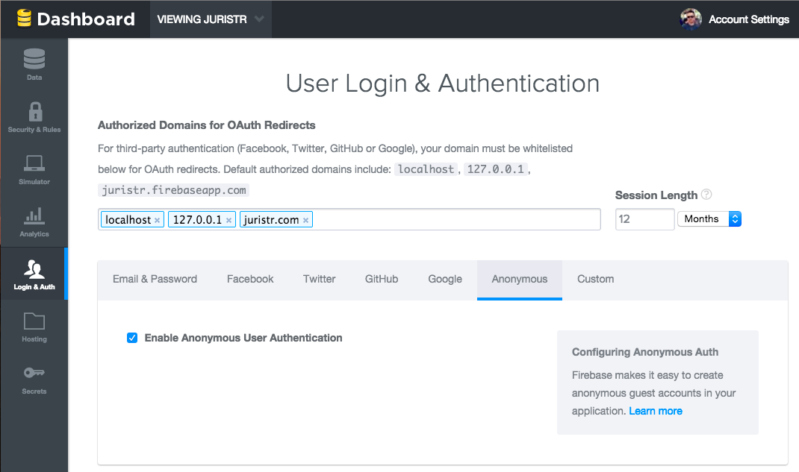

Kudos for your site [](https://travis-ci.org/juristr/kudos-jekyll) [](http://gruntjs.com/)
---

This project started at a small, snowy afternoon project with the aim to experiment a little with Jasmine, Firebase, Grunt and Travis-CI integration.

The idea is to give people Kudo support for their site or blog. Originally Kudos have been introduced by the [Svbtle blog](https://svbtle.com/) engine.

## Demo

You can see the script live on my own blog at [http://juristr.com/blog](http://juristr.com/blog).

## Building

Just clone the repo and execute

```
$ npm install
$ grunt
```

This should install the required packages and then compress the required files and copy them to the `dist` directory.

> Note, you need to have `grunt-cli` installed. Execute `npm install -g grunt-cli` in case you don't have it already

## Installation

Follow these steps to setup kudos for your site.

**Step 1 - Firebase account**  
This kudo script uses Firebase as the backend data store. As such, you first need to create a [Firebase account](https://www.firebase.com/) and create a new database. You can obviously also reuse an existing one if you want so.

**Step 2 - Configure Firebase**  
Open `kudos.firebase.min.js` (or the non-minified `kudos.firebase.js`) and change the `firebaseUrl` to have it point to the one you just created in step 1.

```javascript
...
// replace this url with yours!!
var firebase = new Firebase('https://<yourdb>.firebaseio.com/'),
    firebaseKudos = firebase.child('kudos'),
    ...
...
```

Next, you need to **configure your Firebase store's authentication** and add proper security rules.

Activate _anonymous authentication_ and configure the authorized domains (normally localhost for debugging and your site's domain name).



Finally you also need to register some **security rules in the "Security & Rules"** section of your Firebase backend. Simply copy&paste the following:

```json
{
    "rules": {
        
        "kudos": {
          "$url": {
            ".read": true,
            ".write": "data.child('likes').val().length === 0",
            
            "likes": {
              "$userid": {
                ".read": true,
                ".write": "auth.uid === $userid"
              }
            }
          }
        }
    }
}
```

**Step 3 - Include kudo scripts**  
Include the kudo scripts from the `dist` directory

```html
<!-- Kudos script -->
<script type='text/javascript' src='https://cdn.firebase.com/js/client/1.1.2/firebase.js'></script>
<script type="text/javascript" src="/dist/kudos.min.js"></script>
<script type="text/javascript" src="/dist/kudos.firebase.min.js"></script>
<link rel="stylesheet" href="/dist/kudos.min.css">
```

Note that you need to have jQuery as well.

**Step 4 - Add HTML snippet**  
As the last step include the following snippet

```html
<figure class="kudo">
</figure>
```

in your DOM where you'd like to have the kudo element appear and initialize it by invoking

```javascript
$('figure.kudo').kudoable({
    dataStore: window.firebaseStorage
});
```

That's it. You should be ready to go.

## Issues, Bugs, Enhancements..

Simply use [GitHub's issues](https://github.com/juristr/kudos-jekyll/issues). PRs are welcome as well :)

## Credits

Credits have to be given to [Amit Upadhyay](http://amitu.com/2013/04/kudos-using-parse-for-jekyll/) who provided the original Svbtle independent Kudo implementation by using [Parse](https://parse.com/) as the backend service.
